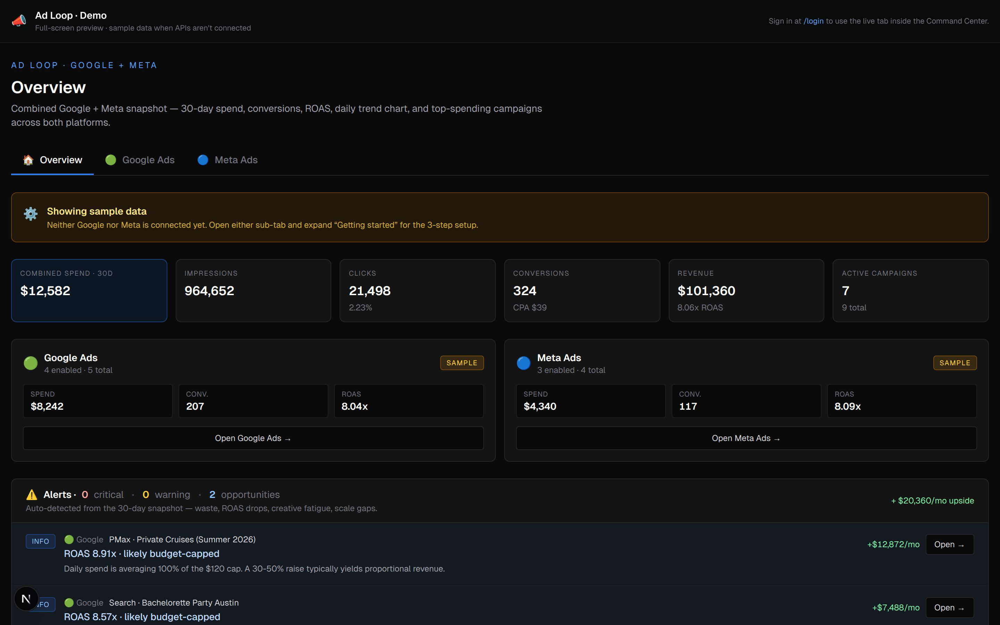
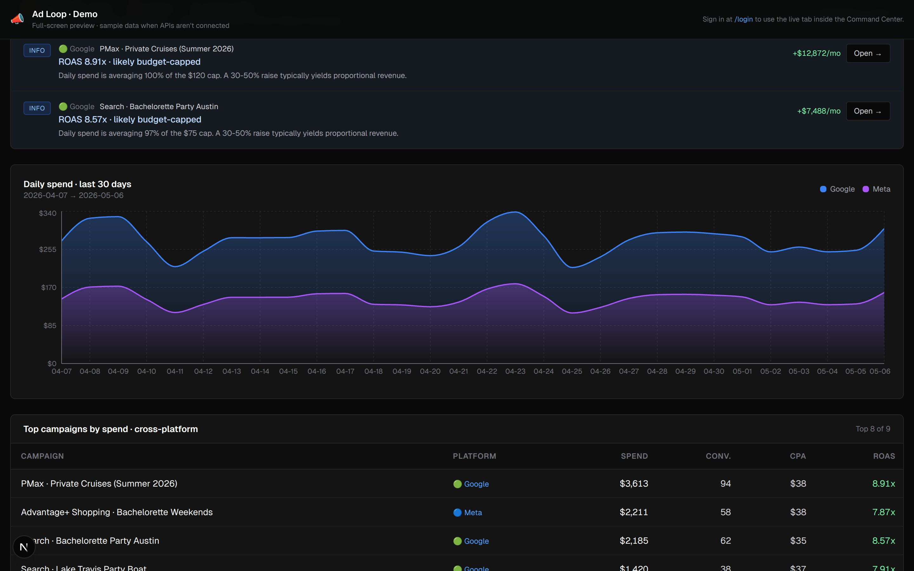
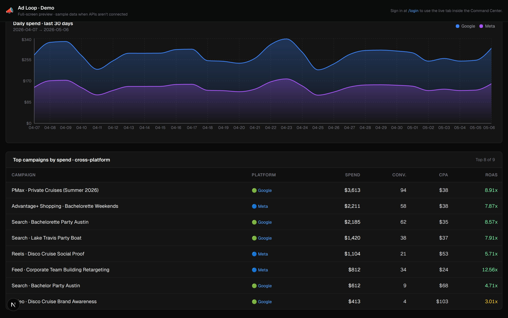
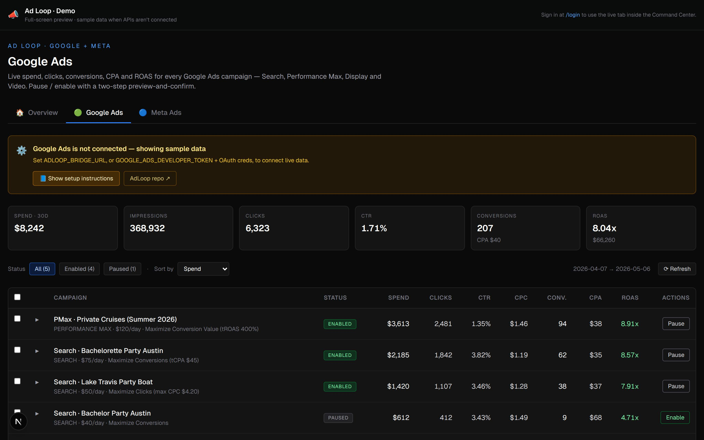
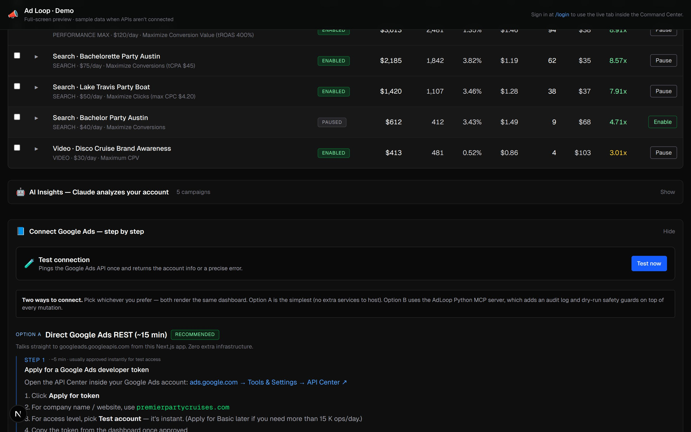
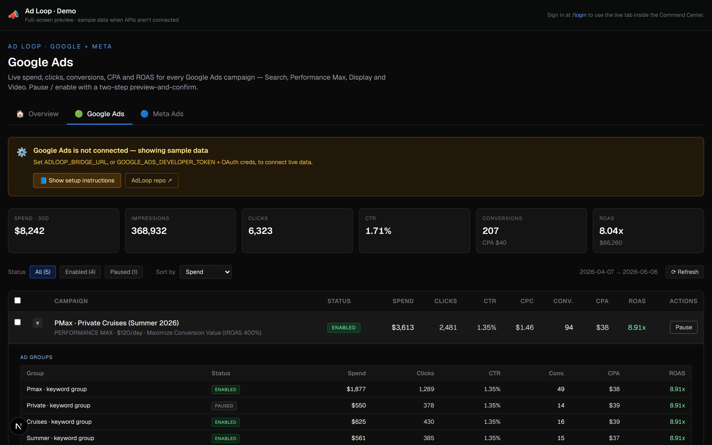
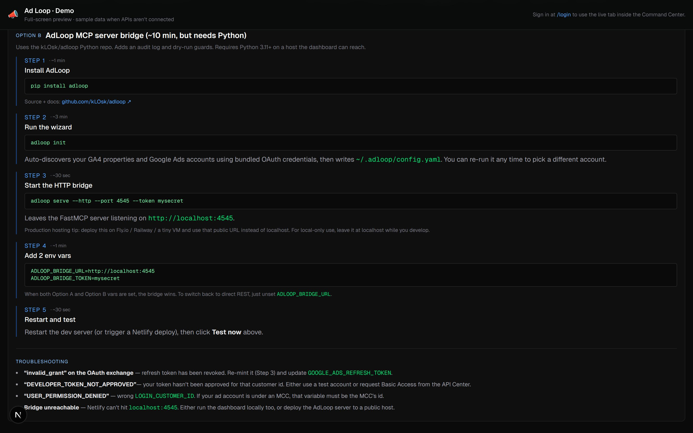
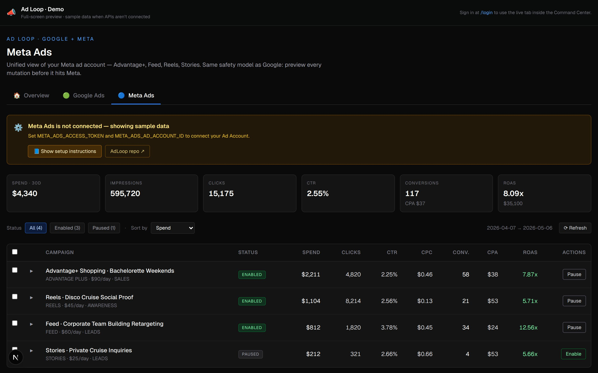

# Ad Loop dashboard — visual preview

Captured live from `npm run dev` against `/demo/ad-loop` using Playwright +
the project's bundled `@sparticuz/chromium`. Images are 1440×900 @ 2× DPI
JPEG. Re-run with `node scripts/screenshot-ad-loop.mjs` to refresh.

## Overview tab (combined Google + Meta)





## Google Ads tab






## Meta Ads tab



## How to view live

Right now ports inside this Claude sandbox don't tunnel to your browser, so
`localhost:3100` from your Mac can't reach this server. Three ways to see
the dashboard live:

1. **Pull + run on your Mac.** From Claude Code Desktop:
   ```bash
   cd ~/Desktop/ClaudeCode/seo-dashboard
   git fetch origin
   git checkout claude/google-ads-dashboard-WnAC9
   git pull
   npm install
   npm run dev   # then open http://localhost:3000/demo/ad-loop
   ```
2. **Deploy to Netlify.** `npm run build && npx netlify deploy --prod
   --dir=.next --site=843ba33c-5888-4098-bb8c-eb35889c1430` — then visit
   `https://seo-command-center.netlify.app/demo/ad-loop`.
3. **View these screenshots.** Refreshed any time the dashboard changes.
